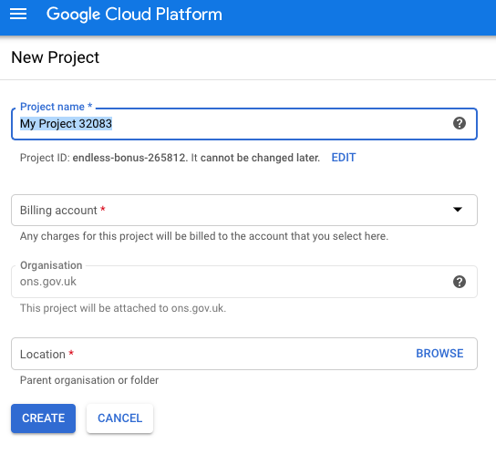
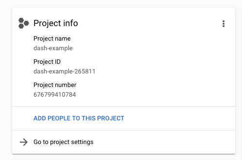
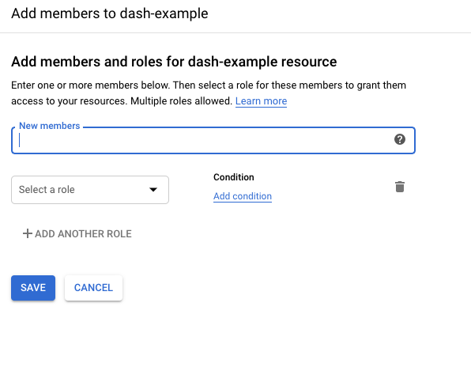

# White Ribbon Alliance - What Women Want Survey Dashboard

This is a Dash interactive Python dashboard developed by Thomas Wood (https://fastdatascience.com).

It's currently deployed at https://whatwomenwant.whiteribbonalliance.org, hosted on Google App Engine.

It's based on the Dash Oil and Gas demo by Plotly: https://github.com/plotly/dash-sample-apps/tree/master/apps/dash-oil-and-gas

You will need Python 3.7, Flask, Plotly and Dash to run it.

## About the app

This Dash app displays survey responses. There are filters at the top of the app to update the graphs below. By selecting or hovering over data in one plot will update the other plots ('cross-filtering').

## Built With

- [Dash](https://dash.plot.ly/) - Main server and interactive components
- [Plotly Python](https://plot.ly/python/) - Used to create the interactive plots
- Google Cloud Platform for deployment

## Where is the data?

The data is derived from the repo https://github.com/whiteribbonalliance/what_women_want

The Jupyter Notebook 13_make_clean_dataset_for_dashboard.ipynb in that repo cleans the data and joins the hand tagged data with the BERT data for loading by the dashboard code.

The app and the data are all running on Google Cloud Platform in project "What Women Want" (ID deft-stratum-290216). You will need access to this project to work on the dashboard.

The data is in project What Women Want, in Google Cloud Storage bucket called wra_what_women_want, in pickle format. It's not publicly accessible but the App Engine app is allowed to access it.

## Getting Started

### Running the app locally from Python - no Docker

Clone the git repo
```

git clone https://github.com/whiteribbonalliance/www_dashboard
cd www_dashboard

```

Create a virtual environment with conda or venv inside the root folder, then activate it.

```
virtualenv venv

# Windows
venv\Scripts\activate
# Or Linux
source venv/bin/activate
```


Go into the app folder and install the requirements with pip

```
cd app
pip install -r requirements.txt
```

Run the app

```
python main.py
```

### Running the app locally from Python - with Docker

After cloning the repo, cd into app and then to build the Docker image, run

```
bash docker_build.sh
```


To run the Docker image, run

```
bash docker_run.sh
```

It will run on port 8080.


# Deploying the app to the internet (Google Cloud Platform)

Instructions adapted from https://github.com/datasciencecampus/deploy-dash-with-gcp

Important files:

* `main.py` is the Dash application
* `.gcloudignore` is like `.gitignore` for GitHub, it tells GCP what not to upload (for example here, I don't want to upload all the screenshots used in this guide)
* `app.yaml` is used to run the Dash app on GCP using [gunicorn](https://gunicorn.org/), which is needed for GCP
* `requirements.txt` comprises the packages needed to run the Dash app (important: gunicorn is required in this file at the bare minimum)

#### main.py

The `main.py` python script comprises the following, which are split into sections below.


**Load Data**

This section loads the csv file from the `/data` folder, creates a pandas dataframe and then applies the add and multiply number functions.

**Project Dashboard**

This is the core of the Dash application.

**Callback Functions**

The functions which are called by the front end when the user changes filters. These are factored into a separate file.


**main**

```
if __name__ == '__main__':
    app.server(host='0.0.0.0', port=8080, debug=True)
```

It is important you make a note of the port number and host!

#### requirements.txt

The `requirements.txt` file, which tells GCP which packages to install.

#### app.yaml

This is a really important file, and needs to replicate what is put in your `main.py` script.

This file tells GCP how to create the application. The first line specifies the service name, which becomes the prefix of the URL the app will run on. Yhe second line specifies that we want to build using python 3.7. The basic_scaling and resources blocks tell App Engine what the environment should be. Here we are limiting the instances to 2, on a machine with 1 CPU and 1 GB of RAM. The entrypoint line must replicate what is at the end of `main.py` (the host and port numbers), as well as what you call the python script (here `main.py` = `main`). This is the most likely file to corrupt a build.

## Step 2: Deploy your Application to Google Cloud Platform

This guide builds on other guides such as [Jamie Phillips'](https://www.phillipsj.net/posts/deploying-dash-to-google-app-engine/).

The following steps are to deploy a Dash application to GCP. If your app doesn't work locally, you should fix that first as it won't work on GCP (even if you pray real hard). If it works locally, but it doesn't deploy, the majority of the time it will be due to the `app.yaml` file.

### Step 2.1: Make a Project on GCP

Using the CLI or the Console Interface online (which we use below), create a new project with a suitable project name (here we call it `dash-example`).



### Step 2.2: Make Yourself the Owner of Project

Make sure the project you've just created is selected on the console, then click 'ADD PEOPLE TO THIS PROJECT'.



Then input your user name and set the role to `Project` > `Owner`.



That's it for now on the Google Cloud Platform Console.

### Step 2.3: Deploy Using gcloud Command Line Tool

If you haven't installed the [gcloud command line tool](https://cloud.google.com/sdk/gcloud/) do so now.

Set the project ID, for example

`gcloud config set core/project deft-stratum-290216`

Next, check your project is active in gcloud using:

`gcloud config get-value project`

Which will print the following on screen:

```
Your active configuration is: [default]

my-project-id
```

To change the project to your desired project, type:

`gcloud config set project project-id`

Next, to deploy, type:

`gcloud app deploy`

After doing this, please make sure to log into Google App Engine in the browser and *delete* any old versions of the app. Normally the deploy command should stop the old versions, but this will not always happen, and if the old ones aren't turned off then it could get expensive.

Then select your desired region (we use `us-east1`)

If you have setup your configuration correctly then it will deploy the Dash app (after a while), which will be available at:

`https://project-id.appspot.com/`

In the command line you can open the browser at the page with

`gcloud app browse -s [APP ID]`

If something goes wrong in deployment you can view logs with:

`gcloud app logs tail -s www-dashboard`

To stop a deployment

`gcloud app versions stop [VERSION NO]`


The rules about mapping the subdomain to Google App Engine servers are in dispatch.yaml. To modify and upload these, use command:

`gcloud app deploy dispatch.yaml`


## Step 3: Restrict Access to your Application

By default your application will be accessible to anyone in the world. To restrict the access you can use [Firewall Rules](https://cloud.google.com/blog/products/gcp/introducing-app-engine-firewall-an-easy-way-to-control-access-to-your-app).


# Who to contact

Thomas Wood, https://fastdatascience.com